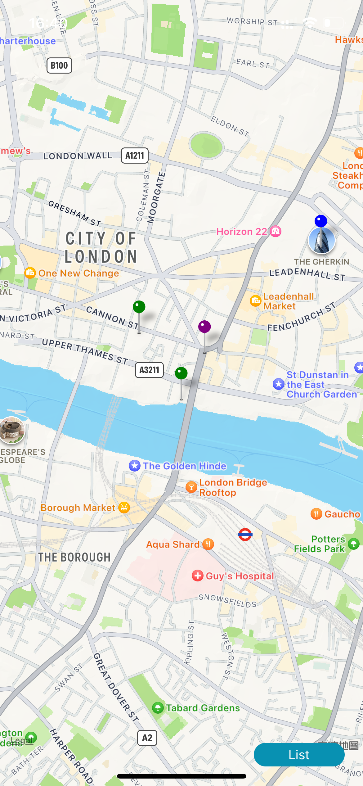
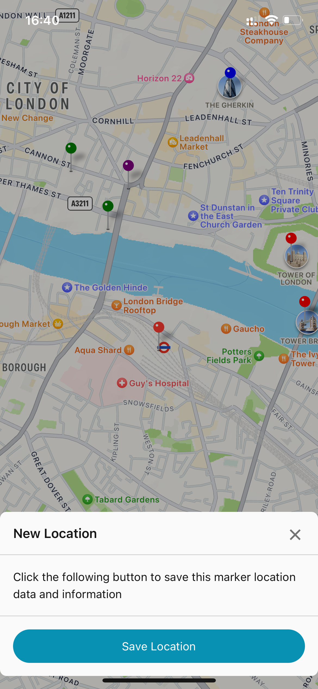
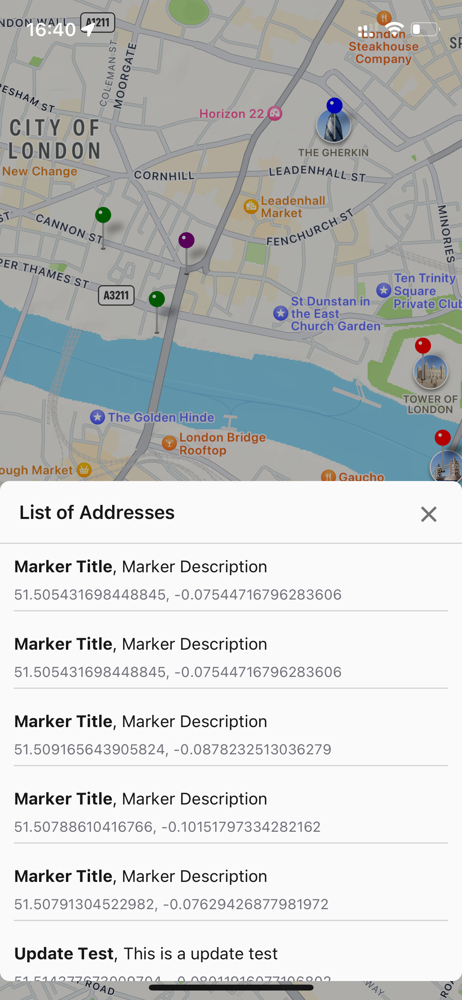
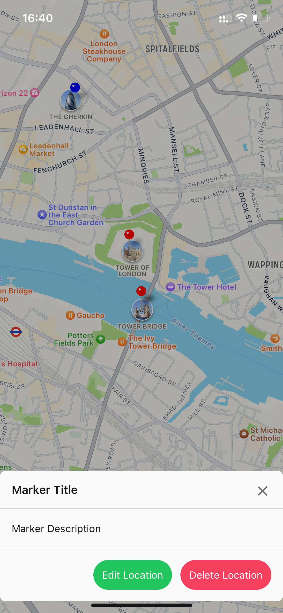
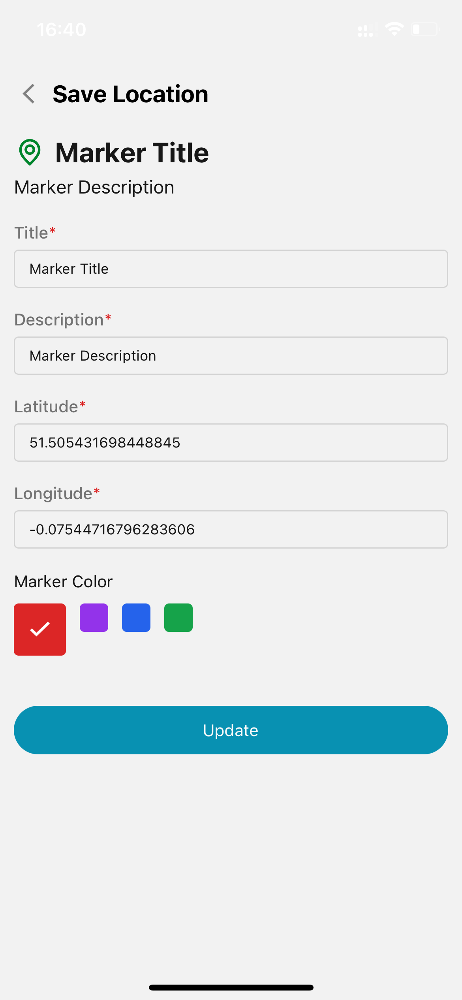
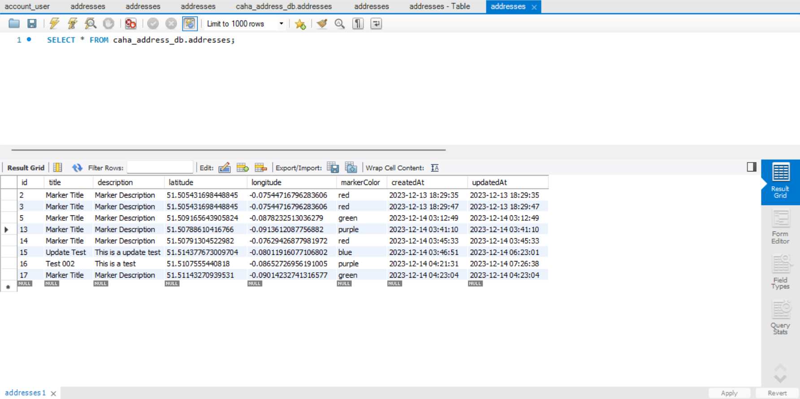

# Direct-Line-Group-Task Overview

This project follows a separate development model for both the front-end and back-end. The front-end development employs React Native, TypeScript, and RTK (Redux Toolkit) technology, providing a robust and efficient framework for creating dynamic and interactive mobile applications. The back-end is primarily based on Node.js using Koa2, a lightweight and expressive framework for building scalable and maintainable server-side applications. Nodemon has been employed to facilitate global listening during development, enhancing the workflow efficiency.

The entire project has undergone thorough debugging and testing within the Expo environment on a personal iOS device, ensuring a seamless and reliable user experience.

<br />


<br />
<br />

## Table of Contents
- [Usage](#usage)
- [Introduction](#introduction)
- [Technologies In This Project](#technologies-in-this-project)
- [Demo](#demo)


## Usage
### Front End

Terminal
```sh
$ cd cahaFrontend
$ npm install

# Original React Native
$ npm start
# ---------------------
# Expo React Native
$ expo start
```
！！！Note: Need to start the back-end service before starting the front-end to get the data

### Back End

Terminal
```sh
$ cd cahaBackend
$ npm install

# Original koa2
$ npm run start
```

## Introduction
### Front End

#### Task Accomplishments

1. **Map Screen:**
   - Implemented a map using the `react-native-maps` library.
   - Fetched and displayed saved locations from an SQL database.
   - Pinned each location on the map with a marker.
   - Users can save the address by long-pressing on the map.
   - Users can click on the marker to update or delete address data.
   - Initialised map preview latitude and longitude for central London
   - Implemented based on MapView component and useRef, when the user clicks on the marker, the map will automatically focus on the centre of the marker.
  

2. **Add Location Screen:**
   - Enabled users to add a new location or update a location by tapping on the map or marker.
   - Captured the name and description of the location.
   - Users can choose from four different marker colours
   - Saved the new location to a database.

3. **Navigation:**
   - Implemented navigation between the map screen and added location screen using React Navigation (NativeStackNavigator).

4. **Design:**
   - Created a clean and user-friendly UI/UX using `native-base`.

### Back End

#### Task Accomplishments
**Backend and Database:**
   - Established a database using Ko2 and MySQL.
   - Implemented data-related operations such as storage, updating, and deletion.
   - Includes error handling for database operations (e.g., save, update address failures, etc.)

## Technologies In This Project
### Front End

1. React Native
2. Redux Toolkit
3. TypeScript
4. Axios

### Back End

1. Node.js
2. Koa2
3. MySQL

## Demo
### Front End
<div align="center">
    
    
    
    
    
</div>

### Back End
<div align="center">
    
</div>

